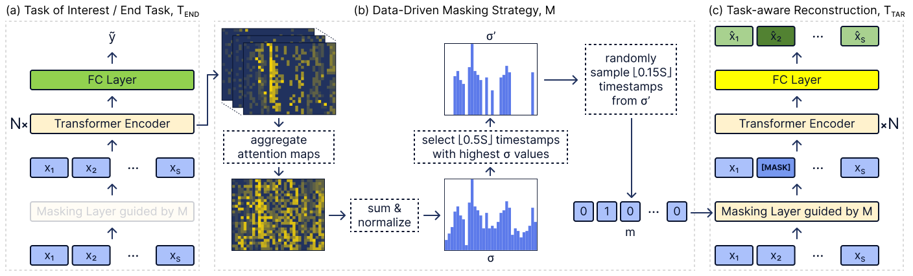

# TARNet for the Classification of Time Series with Missing Values: A Strong Baseline

This repository contains the experiments for the paper [TARNet for the Classification of Time Series with Missing Values: A Strong Baseline](#). This TARNet model focuses solely **on the time series classification task, specifically where time series have missing values**.

The code from this project is a modified version of the official PyTorch implementation of the [KDD 2022](https://kdd.org/kdd2022/) paper [TARNet: Task-Aware Reconstruction for Time-Series Transformer](https://dl.acm.org/doi/10.1145/3534678.3539329).

To find the original implementation, please visit [HERE](https://github.com/ranakroychowdhury/TARNet).




## ☑️ Requirements

Before starting the project make sure these requirements are available:

- [python]. For setting up the environment and Python dependencies (version 3.8 or higher).
- [git]. For versioning your code.

## 🛠️ Setup

### Create a python environment

First, create a virtual environment where all the modules will be stored.

#### Using venv

Using the `venv` command, run the following commands:

```bash
# create a new virtual environment
python -m venv venv

# activate the environment (UNIX)
source ./venv/bin/activate

# activate the environment (WINDOWS)
./venv/Scripts/activate

# deactivate the environment (UNIX & WINDOWS)
deactivate
```

### Install

Check the `requirements.txt` file. If you have any additional requirements, add them here.

To install the requirements run:

```bash
pip install -e .
```

## 🗃️ Data

The datasets used to evaluate the model are found on the [time series classification datasets].
To prepare the datasets for the experiments, follow the steps:

1. Make a new data folder:
    ```bash
    mkdir -p data/raw
    ```

2. Navigate into the new data folder:
    ```bash
    cd data/raw
    ```
3. Download the datasets from the [time series classification datasets] and store them in
    the `data/raw` folder. An example on how to download the dataset is given below:
    ```bash
    wget -nc https://www.timeseriesclassification.com/aeon-toolkit/Adiac.zip
    unzip Adiac.zip -d Adiac
    ```

The datasets used in our experiments are:

Adiac, ArrowHead, Chinatown, ChlorineConcentration, CinCECGTorso, DiatomSizeReduction, Earthquakes, ECG200, ECG5000, ECGFiveDays, FaceAll, FiftyWords, FordA, FordB, Haptics, InlineSkate, ItalyPowerDemand, allat, MedicalImages, MelbournePedestrian, MoteStrain, OSULeaf, Phoneme, Plane, PowerCons, SonyAIBORobotSurface1, SonyAIBORobotSurface2, Strawberry, SwedishLeaf, Symbols, TwoLeadECG, Wafer, WordSynonyms, Yoga.


## ⚗️ Experiments

To run the experiments, run the following commands:

```bash
python ./scripts/train.py --dataset Adiac --lr 0.001 --batch 64 --epochs 100 --sparsity 0.8
```

The script will train and test the model results, storing the performance metrics in the `results` folder.
The training and test will be performed using the 10-fold cross validation.

The input parameters of the train script are:

| Parameter    | Description                                                                       |
| ------------ | --------------------------------------------------------------------------------- |
| `--dataset`  | The name of the dataset. Corresponds to the folder name in the `data/raw` folder. |
| `--lr`       | The learning rate.                                                                |
| `--batch`    | The batch size.                                                                   |
| `--epochs`   | The number of epochs.                                                             |
| `--sparsity` | The sparsity level. Value between 0 and 1.                                        |


NOTE: The current sparsification implementation is the batch sparsification. If you want to change it
to random sparsification, change the `sparsify_time_series_dataset` method in [src/utils.py](src/utils.py).


If the user downloaded all of the good dataset candidates above, they can run the following script to
run the experiment on all of the datasets:

```bash
bash ./scripts/train_all.sh
```

Furthermore, feel free to update the script to run the experiments only for a specific datasets.


[python]: https://www.python.org/
[git]: https://git-scm.com/
[time series classification datasets]: https://www.timeseriesclassification.com/dataset.php
